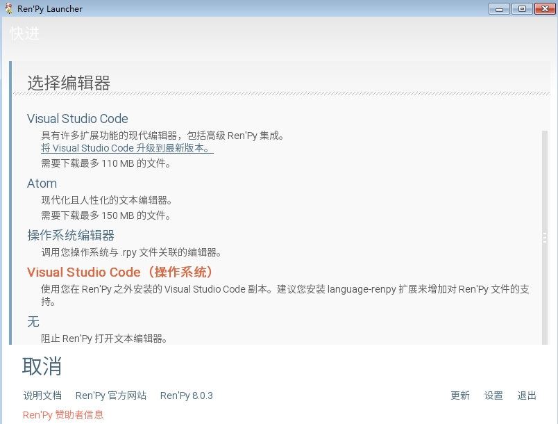
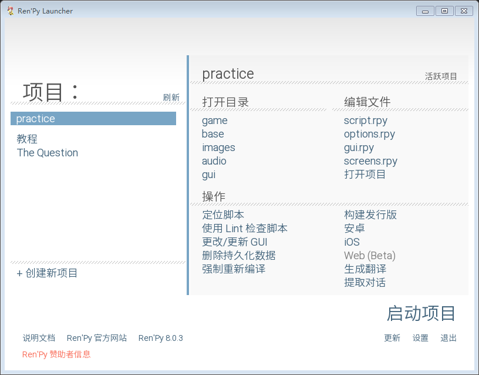

# Ren'Py：从入门到入坟

## 目录

- [Ren'Py：从入门到入坟](#renpy从入门到入坟)
  - [目录](#目录)
  - [在开始之前](#在开始之前)
    - [说明](#说明)
    - [前言](#前言)
  - [初识Ren'Py](#初识renpy)
    - [了解Ren'Py](#了解renpy)
      - [简介](#简介)
      - [Ren'Py能干什么](#renpy能干什么)
      - [Ren'Py支持加载的文件格式](#renpy支持加载的文件格式)
    - [配置](#配置)
      - [安装SDK](#安装sdk)
      - [安装IDE](#安装ide)
      - [配置Ren'Py启动器](#配置renpy启动器)
      - [基本操作](#基本操作)
    - [准备学习](#准备学习)
      - [熟悉Python很重要](#熟悉python很重要)
    - [预备知识](#预备知识)
      - [Ren'Py项目结构](#renpy项目结构)
      - [rpy脚本文件](#rpy脚本文件)
      - [rpyc可执行程序](#rpyc可执行程序)
      - [关键字（keyword）](#关键字keyword)
      - [缩进](#缩进)
  - [Ren'Py语法](#renpy语法)
    - [注释（comment）](#注释comment)
    - [脚本标签（label）](#脚本标签label)
      - [label语句](#label语句)
      - [call语句](#call语句)
      - [jump语句](#jump语句)
      - [return语句](#return语句)
        - [携带返回值](#携带返回值)
        - [标签穿透](#标签穿透)
      - [特殊标签名](#特殊标签名)
      - [全局（global）与本地（local）脚本标签](#全局global与本地local脚本标签)

## 在开始之前

### 说明

作者：ZYKsslm

E-mail：3119964735@qq.com

参考致谢：

1. [Ren'Py官方网站](https://renpy.org/)
2. [Ren'Py中文网](https://www.renpy.cn/)
3. [Ren'Py简中说明文档](https://www.renpy.cn/doc/)
4. [Ren'Py项目开源仓库](https://github.com/renpy/renpy)
5. [Python官方简中文档](https://docs.python.org/zh-cn/3/tutorial/index.html)

### 前言

身为Python的忠坚用户兼开发者之一，Ren'Py于我而言毫无疑问是极具吸引力的。它无疑是我心目中最适合用以制作视觉小说或是Galgame的一个强大实用的开源游戏引擎。在初识Ren'Py时，我就被其易于上手、跨平台性强等特点所深深吸引。

本人同时也是视觉小说一类游戏的忠实爱好者，很高兴PyTom大佬能够用Python开发出如此一个极具魅力的游戏引擎，这让更多游戏开发者能够专注于游戏设计而不是为代码所发愁。这样一来，将促使更多优秀的作品问世。

在学习并使用了Ren'Py一段时间以后，我就发现一个惨痛的事实——Ren'Py的国内社区还并不完善，远远无法和其他游戏引擎相比。有时候发现问题把文档亦或是论坛翻遍也没得出自己想要的结果，但更多的时候是疲于在茫茫网络中苦苦寻找。我相信这对于绝大多数开发者来说可以是致命的。所以，一个想法油然而生：制作一份更加详细、易懂、系统的教程来帮助更多Ren'Py开发者免于到处搜寻却久久找不到答案；帮助Ren'Py开发者写出更加严谨、细致、高效的代码；同时帮助更多初学者入门Ren'Py，最终能够自己独立制作一款游戏（程序）；而且这对我来说也是一个不小的挑战，在编写这份教程的同时，我也在与你们一起学习。

本人并非专业游戏开发者，也不是专业软件工程师，犯错在所难免，欢迎提出指正，我会裨补缺漏，为Ren'Py社区尽一份绵薄之力。希望大家能够相互促进、共同学习、一起将Ren'Py社区建设得更加完善！

## 初识Ren'Py

>合抱之木，生于毫末；百丈之台，起于垒土；千里之行，始于足下。——《老子》

### 了解Ren'Py

#### 简介

可以说，Ren'Py天生就是为视觉小说类游戏而生的。

Ren'Py视觉小说引擎是一款开放源代码的自由软件引擎，用来创作通过电脑叙述故事的视觉小说。Ren'Py之名是Ren'ai与Python两词混合而成。Ren'ai为日文，意指“恋爱”，而Python是Ren'Py所使用的语言环境。
——*[摘自Ren'Py中文社区](https://www.renpy.cn/thread-2-1-1.html)*

简而言之，Ren'Py就是一个能够帮助我们进行游戏开发的工具，能够让我们达到事半功倍的效果。

**且Ren'Py使用超高自由度的MIT协议开源，可以免费商用。**

意思就是你可以任意使用Ren'Py引擎，无需向任何人申请，且要自己承担可能会引起的风险，与开发者并无任何关联。

#### Ren'Py能干什么

Ren'Py几乎支持所有视觉小说所应该具有的功能，包括分支故事、存储和加载游戏、回退到之前故事的存储点、多样性的场景转换等。Ren'Py拥有类似电影剧本的语法，并且能够允许高级用户编写Python代码来增加新的功能。除此之外，游戏引擎内附的出版工具能够为脚本加密以及压缩游戏素材以防止盗版。
——*[摘自Ren'Py中文社区](https://www.renpy.cn/thread-2-1-1.html)*

也就是说，我们不必再去从头开始搭建一个GUI游戏界面，并去实现繁琐的基础功能，这些Ren'Py都会提供给我们，我们只管专心游戏设计就好。

我们前面提到过跨平台性，跨平台意指只需写一次代码，程序就能在多个不同的操作系统中运行，大大节省了我们的时间，提高了开发效率。目前Ren'Py一般支持的平台有Windows、Linux、Mac OS X、Android和iOS以及不太常用的Web前端（Ren'Py 8暂未支持）。


#### Ren'Py支持加载的文件格式

在游戏制作中，我们常常需要有立绘、音频、视频等元素来丰富游戏。

同样在Ren'Py中，我们也需要让Ren'Py加载资源文件。但是Ren'Py支持渲染的图像或播放的音频的文件格式是有限制的，支持的文件格式具体如下：

- 视频格式
  - VP9
  - VP8
  - Theora
  - MPEG 4 part 2 (包括Xvid和DivX)
  - MPEG 2
  - MPEG 1

- 图片格式
  - BMP
  - PNG
  - JPG
  - JPEG
  - GIF

- 音频格式
  - OPUS
  - Vorbis
  - MP3
  - MP2
  - PCM

- 容器格式：
  - WebM
  - Matroska
  - Ogg
  - Avi
  - 多种MPEG格式流媒体
  
  （注意某些格式可能需要专利许可证书。没有把握的情况下，推荐使用VP9、VP8或者Theora、Opus、Vorbis，以及WebM、Matroska或者Ogg。）

### 配置

>[附官方简中文档同步章节](https://www.renpy.cn/doc/quickstart.html)

#### 安装SDK

SDK即为Software Development Kit（软件开发工具包），用于给开发者提供开发工具，就是Ren'Py本体。安装完SDK我们就可以在Ren'Py中编写脚本代码了。

SDK在[Ren'Py官方网站](https://renpy.org/)下载即可，这里我们下载Ren'Py 8版本。（图示左侧）


#### 安装IDE

IDE即为integrated development environment（集成开发环境），是用于提供程序开发环境的应用程序，一般包括代码编辑器、编译器、调试器和图形用户界面等工具。一款优秀的IDE可以让我们更高效地开发。

在支持Ren'Py开发的IDE中，我们选择微软的开源免费的代码编辑器Visual Studio Code。轻便、高效、舒适。

在[vscode官网](https://code.visualstudio.com/)找到与自己对应的版本下载安装即可。


安装完成后，我们打开vscode，打开扩展商店搜索`renpy`并下载Ren'Py扩展插件（图示第一个）。


#### 配置Ren'Py启动器

打开Ren'Py启动器，进入设置，点击 *文本编辑器*，选择 *Visual Studio Code（操作系统）*，这样，刚才安装的vscode就成了我们的默认文本编辑器了。



#### 基本操作

1. 点击 *创建新项目* 以创建一个新项目。

2. 点击 *启动项目* 以运行一个项目。

3. 点击 *打开项目* 以使用默认文本编辑器打开项目目录。

详细使用请参考[简中说明文档](https://www.renpy.cn/doc/quickstart.html)



### 准备学习

#### 熟悉Python很重要

因为Ren'Py是基于Python制作的，所以有很多语法和概念都和Python相似甚至是一样。

如果你已经熟练掌握Python，那么相信学习Ren'Py对你来说并不是什么难事，甚至只是相当于学习一个第三方库而已。所以，先熟悉Python将会使你的Ren'Py学习之路更加平坦。

本教程会涉及一些Python语法，进行更加细致的讲解。不过如果你不会Python也不要紧，在每个需要用到Python知识的章节中都会附上教程链接以供参考学习。

这里先附上Python教程：[Python官方简中文档](https://docs.python.org/zh-cn/3/tutorial/index.html)，你也可以在像 *Bilibili* 等视频网站找相关视频学习。

那么，在进行完所有的前置准备后，我们就要开始正式学习Ren'Py语法了。

### 预备知识

#### Ren'Py项目结构

>[附官方简中文档同步章节](https://www.renpy.cn/doc/language_basics.html#base-directory)

Ren'Py项目目录分为 *基础目录* 和 *游戏目录*。

**基础目录**即为以创建项目时输入的项目名为名的目录，一般用于存放与游戏本体无关的信息如 *LICENSE* 和 *README* 等。

**游戏目录**即为位于基础目录下的名为 *game* 的目录，用于存放游戏资源和脚本文件等。

一个标准的Ren'Py项目目录结构应如下所示：

- Project
  - log.txt
  - game
    - audio
      - ......
    - fonts
      - ......
    - gui
      - ......
    - images
      - ......
    - saves
      - navigation.json
      - persistent
    - tl
      - common.rpym
      - ......
    - gui.rpy
    - gui.rpyc
    - options.rpy
    - options.rpyc
    - screens.rpy
    - screens.rpyc
    - script.rpy
    - script.rpyc
    - SourceHanSansLite.ttf
    - ......
  - ......

*Project* 即为你的项目目录也是基础目录，基础目录下的 *game* 目录即为你的游戏目录。

#### rpy脚本文件

[附官方简中文档同步章节](https://www.renpy.cn/doc/language_basics.html#files)

在初次创建项目时，游戏目录下会自动生成一个名为 *script.rpy* 的脚本文件，你可以直接在里面编写代码或是自己创建脚本文件。脚本文件可以有一个或多个。

游戏目录中后缀名为 *rpy* 的文件就是Ren'Py的脚本文件，用于编写脚本代码。

一个rpy脚本文件的文件名应遵守如下命名规范：

1. 全小写并使用下划线，如：`this_is_an_example`；或使用驼峰命名法，如：`thisIsAnExample`。
2. 具有意义。
3. 开头不包含数字。

另外，在游戏启动时，所有脚本文件内的数据都会被放在一起，这是因为Ren'Py会读取游戏目录下的所有脚本文件。这意味着所有脚本文件内的数据都是通用的，意味着任何脚本文件内的数据都能够被同时自由访问。

简单来说：

1. 所有变量都能够跨文件访问。如你在一个脚本文件中定义了变量 *var* ，那么在任意一个脚本文件中都能够使用变量 *var*。
2. 所有脚本文件中的变量均不能重名。既然所有变量都能够跨文件访问，那么所有变量名当然就不能重名啦。

所以，你既可以将所有代码都写进一个脚本文件中，也可以根据分类写成多个脚本文件。

#### rpyc可执行程序

后缀名为 *rpyc* 的文件是同名rpy脚本文件编译后的二进制可执行程序。

在我们每次编写完代码重启Ren'Py时，会自动生成或更新rpyc文件，运行时会直接运行rpyc文件。因为计算机是无法看懂我们的代码的，所以需要编译成二进制数据让CPU执行，由于Ren'Py不具备解释器（因为本来就是基于Python的，所以使用解释器反而多此一举），所以需要编译成rpyc文件再执行。

在没有rpy文件而有rpyc文件的情况下，游戏依然能够运行其功能，但是最好不要删除rpy文件，因为可能会发生意料之外的错误。

#### 关键字（keyword）

>[附官方简中文档同步章节](https://www.renpy.cn/doc/language_basics.html#elements-of-statements)

关键字，也叫关键词。

关键字是一个英文单词，必须在游戏脚本中合法出现。这些关键字是保留字，不能用作变量名、标签名或任何其他标识符。

Ren'Py中关键字的概念跟Python中的差不多。有Python基础则可以直接理解。

常见的Ren'Py关键字有：
**True、False、None、if、else、elif、for、in、with、at、is、or、not、pass、return、break、continue、label、play、voice、image、define、default、style、transform**等。

#### 缩进

>[附官方简中文档同步章节](https://www.renpy.cn/doc/language_basics.html#block)

如果你学过Python，那么你一定清楚地明白缩进的重要性。Ren'Py与Python一样，使用缩进来表示代码的逻辑。

这里就不再赘述了。

## Ren'Py语法

>问渠那得清如许？为有源头活水来。——朱熹《观书有感 • 其一》

### 注释（comment）

>[附官方简中文档同步章节](https://www.renpy.cn/doc/language_basics.html#comment)

对于程序员来说，写注释是一个重要的习惯。注释用于代码解释或功能提示等，且不会被执行。

好的注释能够让你的代码更加简洁易懂，让你的思路更加清晰，也可以让你日后或别人再看代码时不至于一头雾水。

在Ren'Py中，我们使用符号`#`放在一条语句的**开头**来表示一条注释。注释可以放在任何位置，但不能插在一条代码中间，我们一般置于代码的上面或末尾。

如：

```renpy
# 定义角色对象
s = Character(name=_("Sylvie"))

s "I'm Sylvie." # 希尔薇发言
```

### 脚本标签（label）

>[附官方简中文档同步章节](https://www.renpy.cn/doc/label.html#)

#### label语句

Ren'Py中所有的游戏流程代码都会分别写进数个脚本标签中。脚本标签类似于Python中的函数，用于跳转或调用，但不同的是在写代码时脚本标签可以在定义前调用。

我们使用`label`关键字来定义一个脚本标签，然后是标签名，后面可紧跟一对小括号以添加参数，若没有参数则括号可以省略，最后别忘了加冒号并换行缩进。参数的写法与作用域等与Python函数完全相同，这里附上教程。[Python 3 函数](https://docs.python.org/zh-cn/3/tutorial/controlflow.html#more-on-defining-functions)

```renpy
label sample_label(content):

  "[content]"

  return
```

#### call语句

call语句用于让主控流程进入某一脚本标签中，并在执行完这次调用后，回到原本调用的位置。

我们在脚本标签中使用关键字`call`来实现跳转，后面接一个标签名，表示让主控流程进入指定的脚本标签中。若指定的脚本标签要传入参数，则在标签名后紧跟一对小括号以传参。传参方式与Python函数传参方式完全相同。

```renpy
label start:

  "游戏开始"

  call sample_label("HelloWorld!")

  "游戏结束"

  return


label sample_label(content):

  "[content]"

  return
```

在上面的代码中，游戏开始后主控流程会先进入 *start* 标签，并在对话框中显示`游戏开始`，然后调用 *sample_label* 标签并传入字符串`HelloWorld!`作为参数，随后进入 *sample_label* 标签，并在对话框中显示`HelloWorld!`，最后返回 *start* 标签在对话框中显示`游戏结束`并返回游戏主菜单。

#### jump语句

jump语句用于让主控流程进入某一脚本标签中，并顺势执行下去。

我们在脚本标签中使用关键字`jump`来实现跳转，后面接一个标签名，表示让主控流程进入指定的脚本标签中。注意：**jump语句中指定的脚本标签不能传参。**

但你可以给指定的脚本标签添加默认值参数：

```renpy
label start:

  "游戏开始"

  jump sample_label

  "游戏结束"

  return


label sample_label(content="HelloWorld!"):

  "[content]"

  return
```

在上面的代码中，主控流程进入 *sample_label* 标签时没有给予参数，于是参数 *content* 便使用默认参数值——字符串`HelloWorld!`，随后在对话框中显示`HelloWorld!`，并直接返回游戏主菜单。

#### return语句

return语句标志着一段标签代码块的结束。

我们使用关键字`return`来结束一个脚本标签。

##### 携带返回值

在return语句后加上一个变量名还可以返回这个变量名的值，值储存在变量 *_return* 中。

```renpy
label start:

  "游戏开始"

  call sample_label(8)

  "[_return]"

  return


label sample_label(content):

  # 等价于 $ content = content + 1
  $ content += 1

  return content
```

在上面的代码中，我们调用 *sample_label* 标签并传入参数整数8，随后 *content* 参数也就是整数8自增变成9然后返回 *start* 标签并携带返回值 *content*，此时 *content* 的值储存在变量 *_return* 中，在对话框中输出 *_return* 的值显示为9。

##### 标签穿透

任何脚本标签结束后都应添加return语句，不然将造成标签穿透。

~~Ren'Py脚本标签结束不加return语句就像java中switch case不加break。~~

在一个脚本标签结束后如果没有添加return语句，且下面还有其它脚本标签，则主控流程将直接进入下面的脚本标签，一直到遇到return语句才结束。若下面所有的脚本标签都没有添加return语句则会一直进入到最后一个脚本标签才结束。

```renpy
label start:

  "游戏开始"

  call label_1

  "游戏结束"

  return

label label_1:

  "label 1"

label label_2:

  "label 2"

label label_3:

  "label 3"
```

在上面的代码中，我们调用 *label_1* 标签，进入 *label_1* 标签后在对话框显示`label_1`，随即穿透到 *label_2* 标签，进入 *label_2* 标签后在对话框显示`label_2`，随即穿透到 *label_3* 标签，进入 *label_3* 标签后在对话框显示`label_3`，最后返回 *start* 标签，在对话框显示`游戏结束`，最后返回主菜单。

**可见，任何在脚本标签结束后不添加return语句的行为都是危险的！**

#### 特殊标签名

一些标签名有特殊的作用。常见的特殊标签名有以下这些：

- start
  - 默认情况下，Ren’Py在游戏启动后会跳转至这个标签。

- quit
  - 若该标签存在，当用户退出游戏时该标签内容会被调用。

- after_load
  - 若该标签存在，当游戏读档后会调用这个标签内容。其可能被用于游戏内容更新后的数据修复。

- splashscreen
  - 若该标签存在，游戏首次运行时，在主菜单出现前，该标签内容会被调用。

- before_main_menu
  - 若该标签存在，在主菜单出现前，该标签内容会被调用。

#### 全局（global）与本地（local）脚本标签

Ren'Py中共有两种脚本标签：**全局脚本标签**与**本地脚本标签**。我们一般常用的就是全局脚本标签。

全局脚本标签在所有脚本文件中通用，不能重名；而本地脚本标签则可以重名，但是需要关联一个全局脚本标签。

在定义本地脚本标签时，我们只需要在标签名前添加一个`.`即可，表示这是一个本地脚本标签而非全局脚本标签，它会与上面最近的一个全局脚本标签自动关联。

全局脚本标签与本地脚本标签有以下关系：

1. 一个本地脚本标签只能关联一个全局脚本标签，而一个全局脚本标签可以关联多个本地脚本标签。
2. 在一个全局脚本标签中可以直接访问与之关联的本地脚本标签，而想要访问其它全局脚本标签关联的本地脚本标签则需要使用 *全局脚本标签名.本地脚本标签名* 来访问。
3. 在一个本地脚本标签中可以直接访问与之关联同一个全局脚本标签的本地脚本标签，而想要访问其它全局脚本标签关联的本地脚本标签依然需要使用 *全局脚本标签名.本地脚本标签名* 来访问。

```renpy
label start:

  "这是全局脚本标签start，游戏从这里开始"

  call .local_label_1

  call global_label.local_label_1

  return

label .local_label_1:

  "这是本地脚本标签.local_label_1，关联start全局脚本标签"

  call .local_label_2

  return

label .local_label_2:

  "这是本地脚本标签.local_label_2，关联start全局脚本标签"

  return
  
label global_label:

  "这是全局脚本标签global_label"

  return
  
label .local_label_1:

  "这是本地脚本标签.local_label_1，关联global_label全局脚本标签"

  call .local_label_2

  return

label .local_label_2:

  "这是本地脚本标签.local_label_2，关联global_label全局脚本标签"

  call start.local_label_2

  return
```
