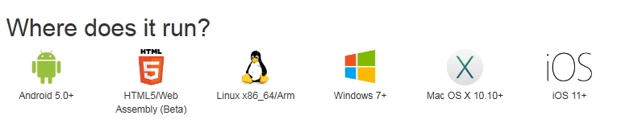
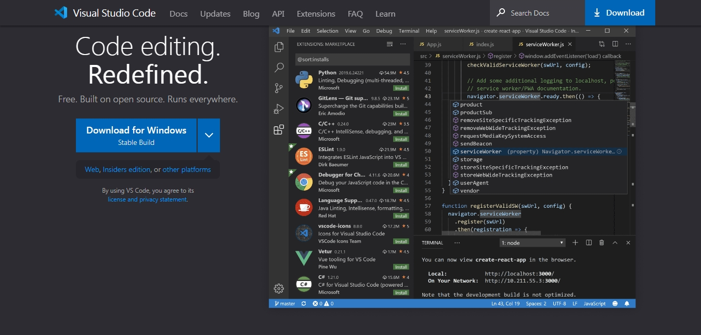
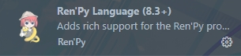
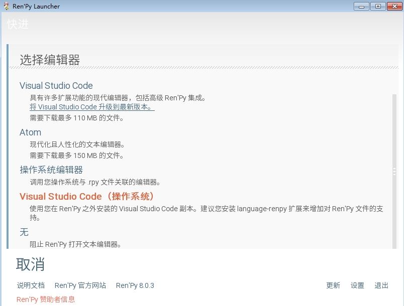
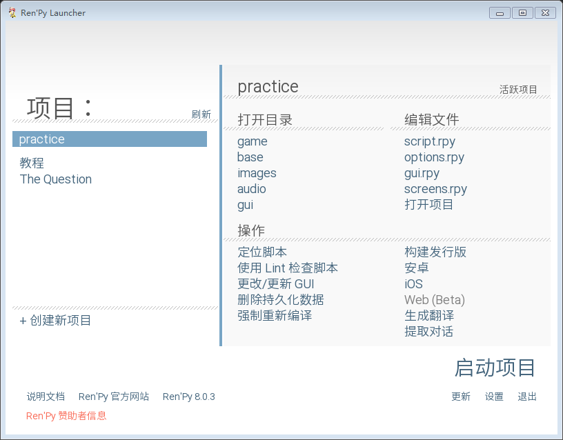

# 你好，Ren'Py。

> 合抱之木，生于毫末；百丈之台，起于垒土；千里之行，始于足下。——《老子》

## 简介

可以说，Ren'Py天生就是为视觉小说类游戏而生的。

Ren'Py视觉小说引擎是一款开源的自由软件引擎，用来创作通过电脑（也包含其他设备）叙述故事的视觉小说。Ren'Py之名是由 *Renai* 与 *Python* 两词混合而成。*Renai* 为日文罗马拼音，意指“恋爱”，而 *Python* 是Ren'Py所使用的语言环境。 

**而且Ren'Py使用超高自由度的MIT协议开源。**

这意味着你可以随意使用Ren'Py引擎，无需向任何人申请，但要承担可能带来的所有责任。

### Ren'Py能干什么

Ren'Py几乎支持所有视觉小说所应该具有的功能，包括分支故事、存储和加载游戏、回退到之前故事的存储点、多样性的场景转换等。Ren'Py拥有类似电影剧本的语法，并且能够允许高级用户编写Python代码来增加新的功能。除此之外，游戏引擎内附的出版工具能够为脚本加密以及压缩游戏素材以防止盗版。 

也就是说，我们不必再去从头开始搭建一个GUI游戏界面，或实现繁多的基础功能，而只需专注于游戏设计。

同时，Ren'Py具有跨平台性。跨平台意指只需写一次代码，程序就能在多个不同的环境（操作系统）中运行，这将大大节省我们的时间，提高开发效率。

基于Python的特性，目前Ren'Py支持的平台有：

- `Windows`
- `Linux`
- *Mac OS X*
- `Android`
- *iOS*
- *Web*
- Raspberry Pi

*对于引用字体平台的支持最为完善*，斜体其次。



### Ren'Py支持的文件格式

一部游戏通常包括图片、音频、视频等元素。

我们可以在Ren'Py中加载这些资源文件，但是Ren'Py支持渲染的图像或播放的影片和音频的格式是有限制的，支持的文件格式具体如下（未经完全测试）：

*引用字体格式为常用推荐格式*

| 类别         | 格式                      | 备注                       |
|:------------:|:------------------------:|:--------------------------:|
| 图像          | `JPEG/JPG`               |                           |
| 图像          | `PNG`                    |                           |
| 图像          | `WEBP`                   |                           |
| 图像          | BMP                      |                           |
| 图像          | GIF                      | 不支持动图                 |
| 音频          | OPUS                     |                            |
| 音频          | `OGG`                    |                            |
| 音频          | FLAC                     |                            |
| 音频          | `WAV`                    |                            |
| 音频          | `MP3`                    |                            |
| 视频（容器）   | `WEBM`                   | 支持VP9、VP8编解码器        |
| 视频（容器）   | `OGG`                    | 支持Theora编解码器          |
| 视频（容器）   | MKV                      | 支持多种编解码器            |
| 视频（容器）   | AVI                      | 支持多种编解码器            |
| 视频（容器）   | MPEG 4 part 2            | 包括Xvid和DivX             |
| 视频（容器）   | MPEG 2                   | 部分支持，取决于具体实现     |
| 视频（容器）   | MPEG 1                   | 部分支持，取决于具体实现     |

> - 图像文件推荐转换为 `WEBP` 格式（WEBP是一种高效的无损或有损图像格式，适合游戏资源）
> - 视频文件推荐转换为 `WEBM` 格式（WEBM是Ren'Py支持的主要视频格式）

## 竟然还不会配置开发环境吗？

如果你已经配置好了开发环境，那么可以跳过这一章节。

### 安装SDK

SDK即为 *Software Development Kit（软件开发工具包）*，用于给开发者提供开发工具，也就是Ren'Py的本体（其中包括一个Ren'Py Launcher）。安装完SDK我们就可以使用Ren'Py来运行我们编写的脚本代码。

SDK可以在[Ren'Py官方网站](https://renpy.org/latest.html)下载最新版。

### 安装IDE

IDE即为 *Integrated Development Environment（集成开发环境）*，是用于提供程序开发环境的应用程序，一般包括代码编辑器、编译器、调试器和图形用户界面等工具。一款优秀的IDE可以让我们更高效地开发。

在支持Ren'Py开发的IDE中，我们选择微软的开源代码编辑器 `Visual Studio Code`，轻便、高效、舒适。

我们可以在[vscode官网](https://code.visualstudio.com/)中找到与自己操作系统对应的版本下载安装。



安装完成后，我们打开vscode，打开扩展商店搜索 `renpy` 并下载Ren'Py扩展插件



### 配置Ren'Py启动器

打开Ren'Py启动器，进入设置，点击 `文本编辑器`，选择 `Visual Studio Code（操作系统）`，这样，刚才安装的vscode就成为了我们的默认文本编辑器了。



### 基本操作

1. 点击 `创建新项目` 以创建一个新项目。

2. 点击 `启动项目` 以运行一个项目。

3. 点击 `打开项目` 以使用默认文本编辑器打开项目目录。

详细使用请参考官方文档。



## 学前准备

### 我不学Python了，Ren'Py！

由于Ren'Py是基于Python的，所以有很多概念和语法都和Python相似甚至是一样。**你几乎可以在Ren'Py引擎中完全使用Python语句！**

**因此我们强烈建议所有Ren'Py使用者都掌握Python基础**。

如果你已经熟练掌握Python，那么相信学习Ren'Py对你来说并不是什么难事，甚至只是相当于学习一个第三方库而已。所以，先熟悉Python将会使你的Ren'Py学习之路更加平坦。本教程会涉及一些Python内容。

如果你是零基础开发者，那么推荐你去一些视频网站（如 *Bilibili*）或是阅读相关书籍学习。

对于Python知识掌握的要求：掌握Python的基本数据类型、流程控制语句、常用的内建函数以及基本的面向对象编程思想。

### Ren'Py项目结构

Ren'Py项目目录分为 *基础目录* 和 *游戏目录*。

**基础目录**即为以创建项目时输入的项目名为名的目录，一般用于存放与游戏本体无关的文件如 *LICENSE* 和 *README* 等。

**游戏目录**即为位于基础目录下的名为 *game* 的目录，用于存放游戏资源和脚本文件等。

一个标准的Ren'Py项目目录结构同时也是项目的初始目录结构应如下所示：

- Project
  - log.txt
  - game
    - audio
      - ......
    - fonts
      - ......
    - gui
      - ......
    - images
      - ......
    - saves
      - navigation.json
      - persistent
    - tl
      - common.rpym
      - common.rpymc
      - ......
    - gui.rpy
    - gui.rpyc
    - options.rpy
    - options.rpyc
    - screens.rpy
    - screens.rpyc
    - script.rpy
    - script.rpyc
    - SourceHanSansLite.ttf
    - ......
  - ......

*Project* 即为你的项目目录也是基础目录，基础目录下的 *game* 目录即为你的游戏目录。

- `log.txt` 文件为游戏日志，包含游戏版本，创建时间等信息。
- `trackback.txt` 文件（若存在）为游戏报错信息。
- `error.txt` 文件（若存在）为脚本报错信息（语法错误）。
- `navigation.json` 文件为项目配置信息。
- `persistent` 文件存储了游戏的持久化数据。
- `.rpym` 文件为游戏翻译文件。
- `.rpy` 文件为游戏脚本
- `.rpyc` 和 `.rpymc` 文件为编译后的二进制文件，游戏真正运行于这些文件。

在游戏中我们使用 `config.gamedir` 和 `config.basedir` 来获取当前游戏的游戏目录和项目目录。

### rpy脚本文件

游戏目录中后缀名为 *rpy* 的文件就是Ren'Py的脚本文件，用于编写脚本代码。你可以直接在里面编写代码或是自己创建脚本文件。脚本文件可以有一个或多个。

一个rpy脚本文件的文件名应遵守如下命名规范：

- 规范格式
  - 全小写并使用下划线，如：`this_is_an_example`
  - 使用驼峰命名法，如：`thisIsAnExample`

- 具有意义

- 开头不包含数字

另外，在游戏启动时，Ren'Py会读取游戏目录下（包括子目录）的所有脚本文件，它们都会被扫描并组合成整个游戏的脚本。

所以请注意：

1. 所有脚本文件中定义的变量都能够被“跨文件”访问。例如你在一个脚本文件中定义了全局变量 *var* ，那么在任意一个脚本文件中都能够访问该变量 *var*。
2. 所有脚本文件中的变量均不能重名。

因此，你既可以将所有代码都写进一个脚本文件中，也可以根据分类写成多个脚本文件，但要注意变量名不能冲突。

### rpyc可执行程序

后缀名为 *rpyc* 的文件是同名rpy脚本文件编译后的二进制可执行程序。

在我们每次编写完代码重启项目时，Ren'Py会自动生成或更新rpyc文件，再次运行时会直接运行rpyc文件而省去编译的过程（若脚本文件没有发生更改）。

所以在没有rpy文件而有rpyc文件的情况下，游戏依然能够运行其功能。但是除了发布版本之外不应删除rpy文件。

**所以，当你更新了某个rpy脚本文件的文件名时，记得同时删除对应的rpyc文件，否则再次运行将造成脚本内容冲突（Ren'Py会根据新文件名生成新的rpyc文件）！**

### 关键字

关键字是一个英文单词，必须在游戏脚本中合法出现。这些关键字是保留字，不能用作变量名、标签名或任何其他标识符。

Ren'Py中关键字的概念类似于Python中的关键字。

同时，Ren'Py中还有一些预留名同样不能作为变量名使用，否则将引发错误。

这是完整的预留名列表：[预留名](https://doc.renpy.cn/zh-CN/reserved.html#reserved-names)

### 缩进

如果你学过Python，那么你一定清楚地明白缩进的重要性。Ren'Py与Python一样，使用缩进来表示代码的逻辑。

~~这里就不再赘述了。~~

才怪！

笔者见过太多人因缩进问题而导致逻辑不一、程序运行异常甚至报错的问题。缩进是Python语言的灵魂，直接关系到整个程序的运行，这就是缩进的重要性！

说到缩进，这里就不得不再提一下 *语句块 (block)* 了。简而言之，语句块通常由缩进来体现，**一个语句块就是一行或一组完整的代码**，且语句块可以嵌套。

```renpy
"一个语句块"
```

```renpy
if True:
    "这是if语句块"
    "还是在if语句块中"
```

```renpy
image:
    block:
        "这是block语句块"
        "也在image语句块中"
```

### 注释

对于程序员来说，写注释是一个重要的习惯。注释用于代码解释或功能提示等，且不会被执行。

好的注释能够让你的代码更加简洁易懂，让你的思路更加清晰，也可以让你日后或别人再看代码时不至于一头雾水。

和Python一样，在Ren'Py中我们以使用`#`号放在一条语句的**开头**来表示一条注释。

注释可以放在任何位置，但不能插在一行代码的前面或中间，我们一般置于一行代码的上一行或末尾。


```renpy
# 定义角色对象
define s = Character("Sylvie")
init python:
    s = Character("Sylvie") # Python等效语句

label start:
    s "Hi, I'm Sylvie." # 希尔薇发言
    $ s("Hi, I'm Sylvie.")  # Python等效语句
    $ renpy.say(s, "Hi, I'm Sylvie.") # Python等效语句

    return
```


那么，在进行完所有的前置准备后，我们就要开始正式学习Ren'Py语法了。
